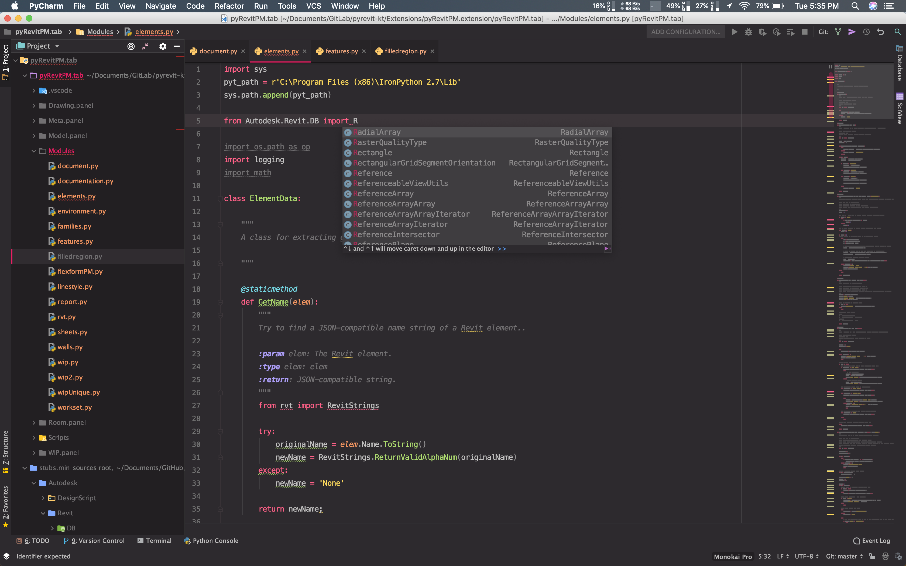

# PyCharm Resources

## Developer Essentials

#### [PyCharm Setup](Assets/pycharm_setup.pdf/)
> How to set up PyCharm for Revit API intellisense, autocomplete, and linting functionality.

#### [PyCharm Settings](Assets/settings_windows.jar/)
> Snapshot of Petr's PyCharm settings.