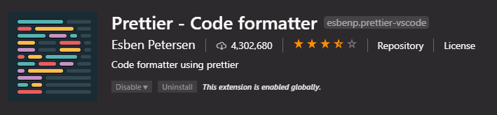
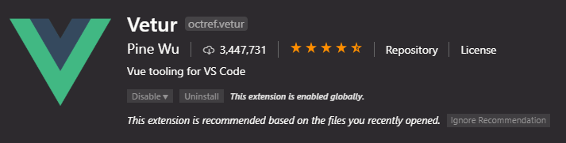
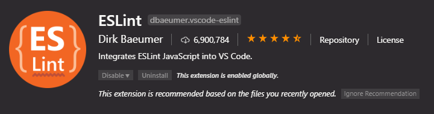

[Back](/../../tree/master)

# VSCode Resources

## Developer Essentials

#### [VSCode Python Setup for AEC](https://github.com/gtalarico/ironpython-stubs/wiki/Visual-Studio-Code)

> How to set up VSCode for (Python) Revit API intellisense, autocomplete, and linting functionality.

#### [VSCode Extensions](Assets/extensions.md)

> Snapshot of Petr's installed VSCode Extensions.

#### [VSCode Shortcuts](https://code.visualstudio.com/shortcuts/keyboard-shortcuts-windows.pdf)

> VSCode keyboard shortcuts on Windows.

## Recommended Extensions

#### [Prettier](https://prettier.io/)

> Code formatter and style-enforcer.
>
> 

#### [Vetur](https://github.com/vuejs/vetur)

> Vue.js language extension for VSCode.
>
> 

#### [Live Share](https://code.visualstudio.com/blogs/2017/11/15/live-share)

> Allows for real-time pair/group coding on a single file or project.
>
> 

#### [ESLint](https://eslint.org/)

> Integrates ESLint with VSCode to provide code-checking and error finding.
>
> 