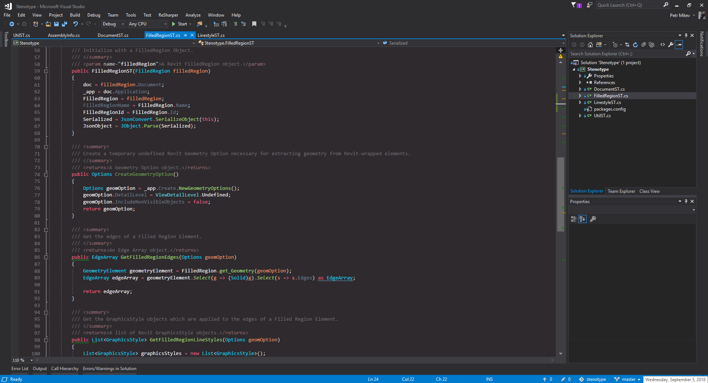
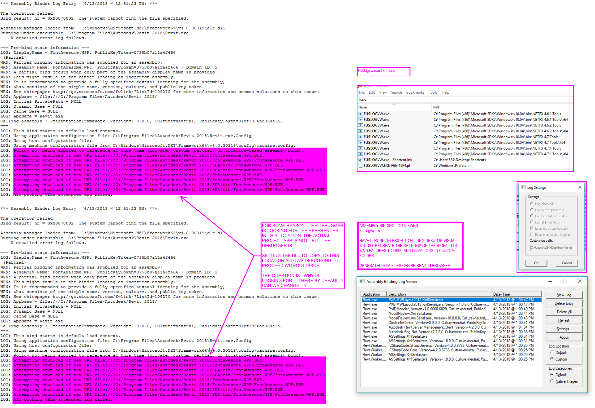
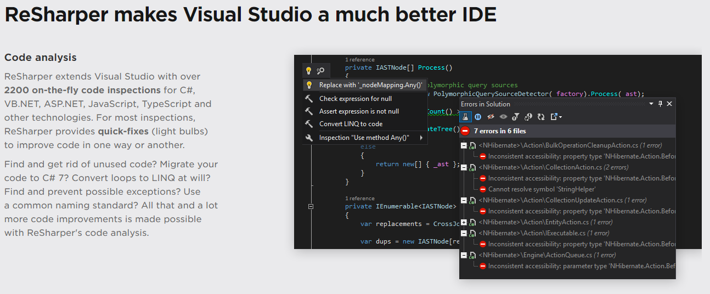

# Visual Studio Resources

## Developer Essentials

#### [Windows Settings](Assets/windows_visual_studio.vssettings/)
> Settings for Visual Studio on Windows. Includes semantic colorizer config.

#### [Visual Studio Templates](http://thebuildingcoder.typepad.com/blog/2017/04/revit-2018-visual-studio-c-and-vb-net-add-in-wizards.html)
> Visual Studio project templates for Revit development.

## Debugging Essentials

#### [Visual Studio Native Debug Settings](/../../tree/master/IDE/VisualStudio/Assets/visualstudio_debugsettings.png)
> How to configure project properties to use Visual Studio's integrated debugging.
> 

#### [Visual Studio Debug Troubleshooting](Assets/visualstudio_debug_troubleshooting.png)
> Sometimes debugging inexplicably fails when using the Visual Studio native debugger. This is typically due to assemblies being looked for in the wrong places. We can find the source of the problem using FUSLOGVW.exe which is included with the Windows SDK. It logs assembly binding failures, and lets you find the true source of errors.
> 

## Add-Ins and Extensions

#### [Semantic Colorizer](https://marketplace.visualstudio.com/items?itemName=AndreasReischuck.SemanticColorizer)
> Allows for more nuanced control over syntax styling for all langauges.
> 

#### [JetBrains ReSharper](https://www.jetbrains.com/resharper/)
> Advanced code formatting/reformatting, refactoring, etc. Helper for writing beautiful POCO C#.
> 