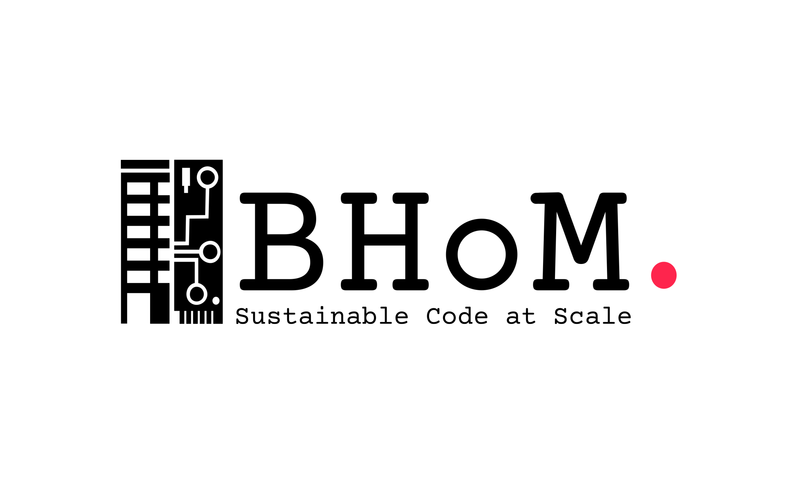

[Back](/../../tree/master)

# Libraries & Frameworks - .NET

## Developer Essentials

#### [Building and Habitat Object Model](https://github.com/BHoM)

> The [BHoM (Buildings and Habitats object Model)](https://github.com/BHoM/documentation/wiki) is a collaborative computational development project for the built environment. It is a collective effort to share code and standardise the data that we use to design, everyday – across all activities and all disciplines.
>
> 