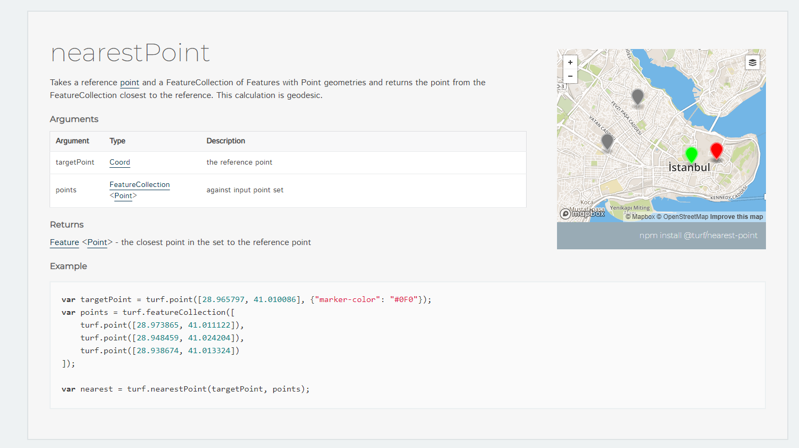
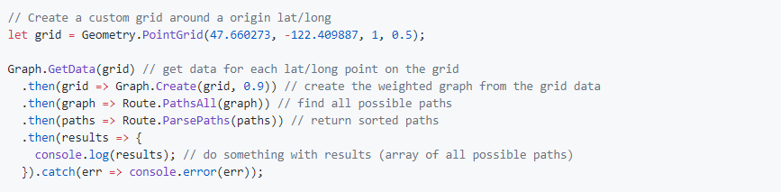

[Back](/../../tree/master)

# Libraries & Frameworks - JavaScript

## Developer Essentials

#### [Turf.js](https://turfjs.org/)

> Advanced geospatial analysis for browsers and Node.js. Features a wide variety of classes and functions for geospatial computation.
>
> 

#### [Stroll](https://github.com/nbbj-digital/stroll)

> Module for finding walkable paths in an urban environment which are maximally exposed to nature. Module members are individually exposed, allowing for low-level manipulation of individual data points for a custom-weighted path/graph.
>
> 