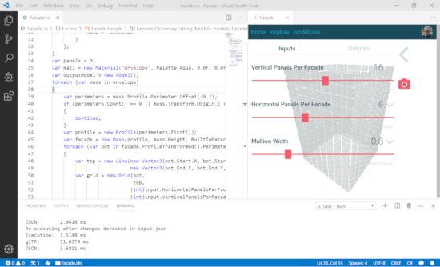

[Back](/../../tree/master)

# Libraries & Frameworks - Universal

## Developer Essentials

#### [Hypar.io](https://hypar.io/)

> Generative design framework complete with developer tools, web interface, and other resources for generative design workflows.
>
> 

#### [Rhino Compute](https://www.rhino3d.com/compute)

> Exposes RhinoCommon API Classes and Functions for cloud-computing.

#### [Autodesk Forge](https://forge.autodesk.com)

> Central hub aggregating the many APIs offered by Autodesk. Can be utilized in backend & frontend applications.
