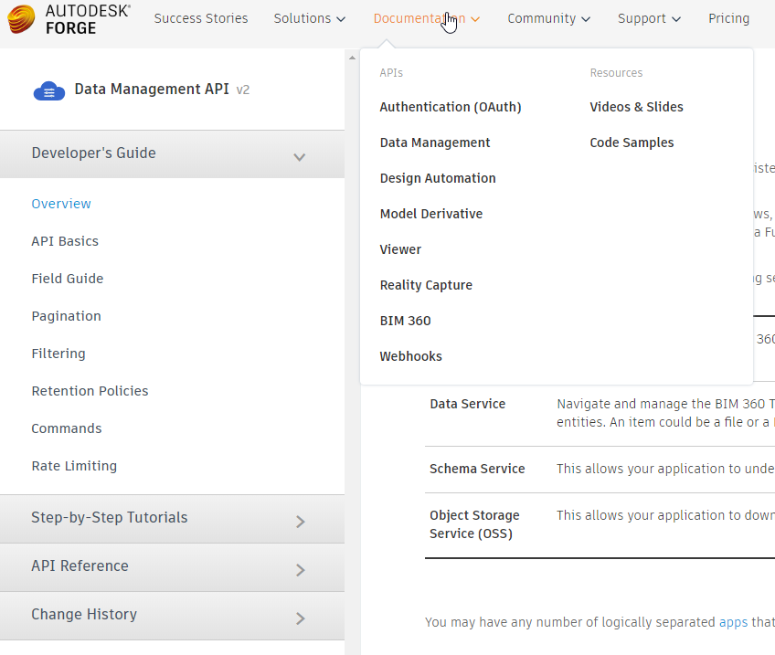
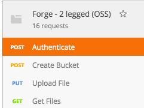

[Back](/../../tree/master)

# Autodesk Forge Resources

## Developer Essentials

#### [Main Forge Portal](https://forge.autodesk.com)
> Your central hub for everything Forge-related.

#### [Learn Forge Tutorials](http://learnforge.autodesk.io/#/?id=learn-autodesk-forge)
> Probably the clearest, most linear tutorials for getting the basics set-up with Autodesk Forge. Includes NodeJS and .NET versions. Every step isn't meticulously documented, but it's as close as there currently is.

#### [API(s) Documentation](https://forge.autodesk.com/en/docs/data/v2/developers_guide/overview/)
> Documentation for the various Autodesk Forge APIs. Includes documentation, conceptual architecture, and basic samples/tutorials.
>
>

## Sample Projects & Code

#### [Forge GitHub](https://github.com/Autodesk-Forge)
> The Autodesk Forge GitHub account contains a number of repositories which serve as sample projects.

#### [Forge Code Samples](https://forge.autodesk.com/code-samples)
> Another interface for the samples in the GitHub account. Allows the user to filter by API and language.

## Other Resources

#### [Postman Calls 3-Legged OAuth](https://youtu.be/WCeX6aq5In0)
> Video guide for setting up [Postman](https://www.getpostman.com/) to make 3-Legged OAuth Forge API calls.
> Useful for getting started with Forge, or just prototyping some business-logic without hard coding it.

#### [Postman Calls 2-Legged OAuth](https://forge.autodesk.com/blog/my-postman-collection)
> Collection of 2-Legged OAuth Forge API calls for [Postman](https://www.getpostman.com/).
>
>

#### [Forge Blog](https://forge.autodesk.com/blog)
> Place for getting help, and interacting with the community.

#### [Forge Stack Overflow](https://stackoverflow.com/questions/tagged/autodesk-forge)
> List of the latest Forge API questinos submitted to [Stack Overflow](https://stackoverflow.com/).

#### [Forge YouTube](https://www.youtube.com/playlist?list=PL_6ApchKwjN9CZCqUl4RZrsyDvnTV)
> Autodesk Forge YouTube channel.

## SDKs

#### [.NET](https://github.com/Autodesk-Forge/forge-api-dotnet-client)
> The Autodesk Forge .NET SDK source.

#### [Node.JS](https://github.com/Autodesk-Forge/forge-api-nodejs-client)
> The Autodesk Forge .NET SDK source.