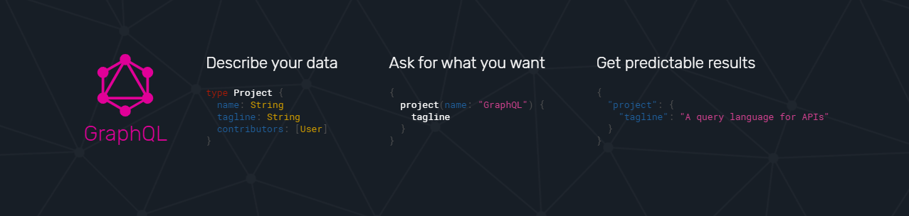

[Back](/../../tree/master)

# GraphQL Resources

## Developer Essentials

#### [GraphQL Portal](https://graphql.org/)

> Central resource for language/framework-specific implementations of the GraphQL Schema.
>
> 

#### [GraphQL Yoga](https://github.com/prisma-labs/graphql-yoga)

> Similar to Express.js for REST APIs, GraphQL Yoga abstracts most of the server configuration to create a GraphQL API.

#### [Apollo GraphQL](https://www.apollographql.com/)

> Another framework for GraphQL implementation, but more involved than GraphQL Yoga.

## Sample Projects & Code

#### [GraphQL Yoga Template](https://glitch.com/~graphql-yoga-template)

> Basic example of a GraphQL API using GraphQL Yoga.

#### [GraphQL Apollo Template](https://glitch.com/~graphql-hello)

> Basic example of a GraphQL API using GraphQL Apollo Server.

#### [GraphQL Yoga Samples](https://github.com/prisma-labs/graphql-yoga/tree/master/examples)

> Collection of example GraphQL servers across different platforms using GraphQL Yoga.

#### [GraphQL Boilerplates](https://github.com/graphql-boilerplates/node-graphql-server)

> Collection of example GraphQL servers ranging between Minimal, Basic, and Advanced.

## Other Resources

#### [Awesome GraphQL](https://github.com/chentsulin/awesome-graphql)

> Collection of useful resources for GraphQL implementation across a series of frameworks and languages.