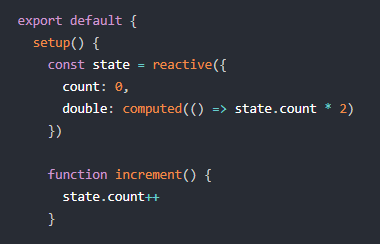

[Back](/../../tree/master)

# Vue.js Resources

## Developer Essentials

#### [Vue.js Home](https://vuejs.org/)

> Central hub for everything Vue. Regularly updated site with documentation, tutorials, and many other crucial resources.

#### [Vue.js Documentation](https://vuejs.org/v2/guide/a)

> The best place to get started with Vue.js and to refer to during development. Vue is known for having some of the best documentation among the modern frontend frameworks, and it is highly encouraged that developers take the time to read through the thurough documentation.

## Sample Projects & Code

#### [Vue Template (Standard API)](https://github.com/mitevpi/vue-template)

> Starter template for Vue projects, including configurations for code quality.

#### [Vue Template (Composition API)](https://github.com/mitevpi/vue-composition-api-template)

> Starter template for Vue projects with the upcoming (Vue 3.0) [Composition API](https://vue-composition-api-rfc.netlify.com/).
>
> 

#### [Vue SSR Example](https://glitch.com/~vue-ssr)

> Vue.js example using server-side rendering.

#### [Vue + D3 Interactive DOM Manipulation](https://codesandbox.io/s/d3-bar-chart-vuejs-okz1r?fontsize=14&hidenavigation=1&module=%2Fsrc%2Fcomponents%2FBarChart.vue&theme=dark)

> Data visualization example using Vue.js to dynamically manipulate DOM elements.
>
> 

## Other Resources

#### [Vuetify](https://vuetifyjs.com/en/)

> UI Component framework for Vue.js built on the Material Design standards. Very well documented, and highly functional.